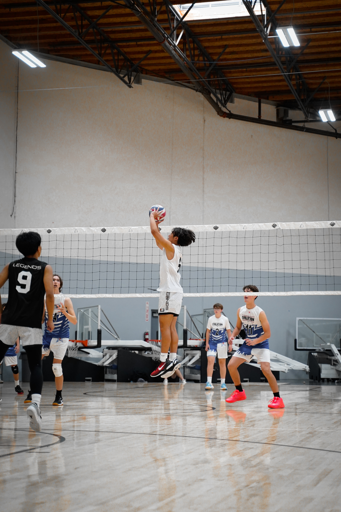

<<<<<<< HEAD

# My Summer ☀️
## **Introduction👋🏽**
Hi, my name is Joren Sakamoto. I am 17 and currently a senior in the G+STEAM Magnet at Chatsworth Charter Highschool. Some of my hobbies include photography, videography, volleyball. I have 2 siblings, one that lives home and one that lives in Japan. I am half Japanese and half Filipino

## **Creative Endeavors👾**
Expanding on my hobbies of videography and photography, I currently have an internship in filming and taking photos for a volleyball club SC Legends. I as well did all video content posted on the Chatsworth Volleyball instagram and edited everything by myself.

## **Sports🏐⛳**
Over the summer I played volleyball, golf, and my recent bowling. In July I went to go play in Orlando, Florida where I participated in the Volleyball Nationals and took **8th** out of a **100+ teams**. Just recently however I've picked up a new hobbies with my brother which is golfing for fun.However only been to the range never a golf course yet. Lastly my new favorite hobby is bowling which I have grown to be really good at.
## **Favorite Summer Food🦞**
During the summer I ate a lot of good foods. That coming with traveling and eating from new places. However my favorite summer food that always is good thats almost like a tradition is a seafood boil. It includes, crab, crawfish, shrimp, sausage, all covered in a cajun sauce. Its almost like a tradition at this point where every summer we eat it with family for all birthdays celebrated in summer
## **Family Tradition🍡**
One family tradition that hold dear to me is a Japanse tradition called Mochitsuki. Mochitsuki is a tradition where we once a year gather and make fresh mochi. Everything is done by us from washing the rice, steaming it, and pounding the mochi to get a perfect consistency to give it that softness. We start usually early in the morning at 6 and go on until 11 where after cleanup we enjoy a big meal. This tradition in my family has been running in my family since **1945**!

## **Photos📷**

